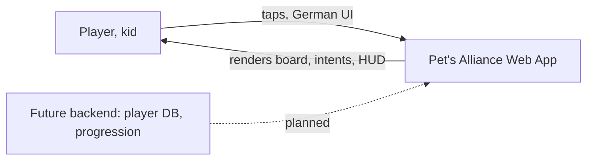

# 3. Context and Scope

## Business context

The app is currently self-contained: a Next.js web app running entirely in the browser. There are no external systems yet. The planned backend (player accounts, meta-progression persistence) is a documented extension point, not an implementation.

## Technical context

- Browser (mobile portrait first) renders the React UI.
- No network calls at runtime beyond loading the app itself.
- No persistence yet — a run is lost on reload (meta-progression will require persistence later).
