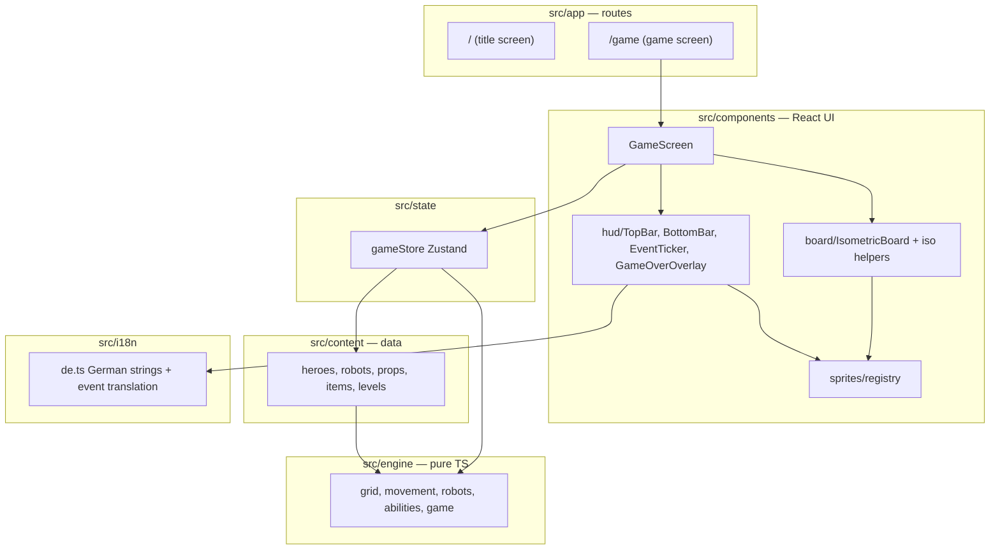

# 5. Building Block View

## Level 1: overall structure

## Modules

### `src/engine/` — game rules (pure)

| File | Responsibility |
| --- | --- |
| `types.ts` | All engine types: content definitions (`HeroDef`, `RobotDef`, `PropDef`, `ItemDef`, `LevelDef`, `Content`) and serializable runtime state (`GameState`, `HeroState`, `RobotState`, `RobotIntent`, `GameEvent`, …) |
| `grid.ts` | Vectors, directions, bounds, adjacency, rotation |
| `movement.ts` | Occupancy queries (`heroAt`, `robotAt`, `isTileBlocked`) and hero movement range (BFS, jump support) |
| `robots.ts` | Robot AI: intent computation (rook-style straight-line movement — stomper picks the best line toward its target, dasher charges its facing direction) and robot phase execution (move, attack, topple, damage) |
| `abilities.ts` | Hero abilities: push (Wegschubsen), nudge (Anschubsen), shield (Funkelschild) and their target queries |
| `game.ts` | Turn state machine: `createGame`, `moveHero`, `useAbility`, `useItem`, `endPlayerTurn`, win/lose evaluation, spawns |
| `testUtils.ts` | Minimal content/level fixtures for engine tests |

Engine functions take the `Content` registry as an explicit parameter; `GameState` holds only ids and plain data.

### `src/content/` — declarative game content

`heroes.ts`, `robots.ts`, `props.ts`, `items.ts`, `levels/level1.ts`; bundled in `index.ts` as `CONTENT`. Adding a robot type or level is a data change here.

### `src/state/gameStore.ts` — UI/engine bridge

Zustand store holding the current `GameState` plus interaction state (selected hero, interaction mode). All mutations go through engine functions. This is the seam where a backend could later take over.

### `src/components/`

- `board/iso.ts` — isometric projection (grid → screen), view box, tile diamond geometry.
- `board/IsometricBoard.tsx` — renders tiles, robot intent overlays, robot heading arrows (first step of the planned path, falling back to facing), action highlights, units/props in painter's order, and a tap layer. Purely presentational; receives state and callbacks.
- `sprites/registry.tsx` — visual id → SVG placeholder component. The only place visuals are defined.
- `hud/` — top bar (round, objective, chaos), bottom bar (unit info card + ability/item buttons + end turn), event ticker, game-over overlay. Tapping a plushie shows its stats and ability explanation; tapping a robot shows its stats, behavior, and the rook-movement rule — the in-game way to learn the rules.
- `GameScreen.tsx` — client component wiring store, board, and HUD into the portrait layout.

### `src/i18n/de.ts` — German strings

All player-facing text, plus `eventText()` translating engine `GameEvent`s into German sentences.

### `src/app/` — routes

`/` title screen (German, hero scene, entry into the game), `/game` game screen. Future screens (setup, level select, settings) get their own routes.
