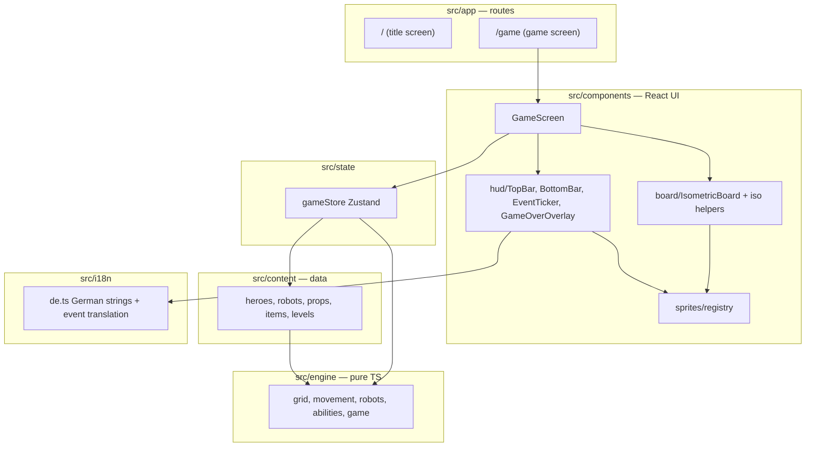

# 5. Building Block View

## Level 1: overall structure

## Modules

### `src/engine/` — game rules (pure)

| File | Responsibility |
| --- | --- |
| `types.ts` | All engine types: content definitions (`HeroDef`, `RobotDef`, `PropDef`, `ItemDef`, `LevelDef`, `Content`) and serializable runtime state (`GameState`, `HeroState`, `RobotState`, `RobotIntent`, `GameEvent`, …) |
| `grid.ts` | Vectors, directions, bounds, adjacency, rotation |
| `movement.ts` | Occupancy queries (`heroAt`, `robotAt`, `isTileBlocked`), terrain queries (`terrainKindAt`, `isTileBlockedForRobot` — cushions block robots but not plushies), and hero movement range (BFS, jump support) |
| `robots.ts` | Robot AI: intent computation for the four behaviors (stomper marches, dasher charges, spinner whirls into all adjacent tiles, bomber self-destructs next to its target), marble-slide physics shared by intents and execution, and robot phase execution (move, attack, topple, damage, explode) |
| `abilities.ts` | Hero abilities: push (Wegschubsen), nudge (Anschubsen), shield (Funkelschild) and their target queries |
| `game.ts` | Turn state machine: `createGame`, `moveHero`, `applyAbility`, `applyItem`, win/lose evaluation, spawns. The robot phase is exposed step-wise for animated playback (`beginRobotPhase` → `executeNextRobot` per robot → `finishRobotPhase`); `endPlayerTurn` runs all three atomically for headless use and tests |
| `testUtils.ts` | Minimal content/level fixtures for engine tests |

Engine functions take the `Content` registry as an explicit parameter; `GameState` holds only ids and plain data.

### `src/content/` — declarative game content

`heroes.ts`, `robots.ts` (stomper, dasher, spinner, bomber, boss Rostzahn), `props.ts` (towers, blocks, book stacks, music box), `terrains.ts` (marbles, cushion), `items.ts`, and `levels/level1..4.ts`; bundled in `index.ts` as `CONTENT` plus the `LEVELS` registry with `LEVEL_ORDER`/`nextLevelId` for the menu and the victory flow. Each level declares its own floor tile visuals, terrain layout, and spawn schedule. Adding a robot type or level is a data change here. Colocated `content.test.ts` sanity-checks every level (existing def ids, in-bounds, no overlaps, enough chaos targets, German strings present).

### `src/state/gameStore.ts` — UI/engine bridge

Zustand store holding the current `GameState` plus interaction state (selected hero, interaction mode). All mutations go through engine functions. This is the seam where a backend could later take over.

The store also orchestrates **animation playback**: `endTurn` plays the robot phase back one robot at a time (async loop over `executeNextRobot` with pacing delays). Each robot first gets a wind-up beat (spotlight marker via `activeRobotId` plus a rev animation), then glides with behavior-specific locomotion (stompers march, dashers lean into the sprint). Engine events are translated into transient board effects (`effects`: impacts, dust, sparkles, floating text) and one-shot CSS unit animations (`unitFx`: hop, wobble, shake, flinch). It keeps a short German event log for the ticker. Delays collapse to zero under `NODE_ENV=test`.

### `src/components/`

- `board/iso.ts` — isometric projection (grid → screen), view box, tile geometry. Tile shapes, positions, and ground markings all derive from two projected axis vectors; sprites are billboards and stay upright. The picture can be rigidly rotated via `BOARD_ROTATION_RAD` (0 = classic corner-on diamond, the current setting); a rigid rotation (after the iso squash, not before) keeps tiles as symmetric 2:1 diamonds with all grid lines parallel.
- `board/IsometricBoard.tsx` — renders tiles, robot intent overlays, robot heading arrows (first step of the planned path, falling back to facing), action highlights, units/props in painter's order, and a tap layer. Moving units glide between tiles via CSS transform transitions (rook moves are straight lines in iso space, so one glide crosses exactly the intermediate tiles). Purely presentational; receives state and callbacks.
- `board/effects.tsx` — transient one-shot effect visuals layered over the board (star burst, dust poof, expanding ring, sparkle cast, floating text), driven by the store's `effects` list. Effects are UI feedback, not game entities, so they live here rather than in the sprite registry.
- `sprites/registry.tsx` — visual id → sprite component. The only place visuals are defined; entries are either drawn SVG placeholders or a frame of a sprite sheet.
- `sprites/sheets.ts` — geometry of the images in `public/sprites/` (frame size, ground anchor, scale, rendering mode) plus the idle frame convention; a still sprite is a one-frame grid. Currently the teddy, the unicorn and the bunny; see [ADR-004](../adr/ADR-004-sprite-sheets.md) for placement and [ADR-006](../adr/ADR-006-hero-art-generation.md) for how the images are produced.
- `hud/` — top bar (level name, round, objective, chaos), bottom bar (unit info card + ability/item buttons + end turn), event ticker, game-over overlay (with a next-level button after a victory). Tapping a plushie shows its stats and ability explanation; tapping a robot shows its stats, behavior, and the rook-movement rule — the in-game way to learn the rules.
- `menu/LevelSelect.tsx` — level cards on the title screen: one per zone with its signature robot, tagline, and feature line; tapping starts that level and navigates to `/game`.
- `GameScreen.tsx` — client component wiring store, board, and HUD into the portrait layout.

### `src/i18n/de.ts` — German strings

All player-facing text, plus `eventText()` translating engine `GameEvent`s into German sentences.

### `src/app/` — routes

`/` title screen (German, hero scene, entry into the game), `/game` game screen. Future screens (setup, level select, settings) get their own routes.
