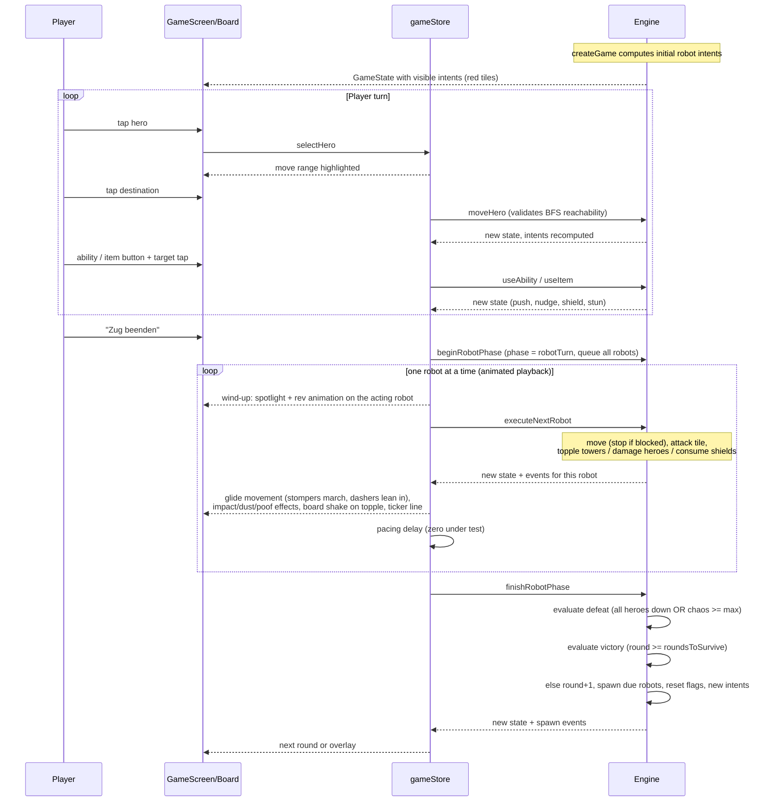

# 6. Runtime View

## The turn loop

## Key runtime rules

- **Robots move on the hex board**: they follow connected hex edges and cannot cross blockers. The stomper picks a path and stop point that gets it closest to its target each turn; the dasher charges along its facing direction. A blocker ends the available movement in that direction.
- **Spinner (Kreisel)** moves like a stomper but attacks ALL six neighboring hexes after moving — heroes and towers alike. Its intent preview marks the whole whirl area.
- **Bomber (Knalli)** marches toward the nearest chaos target and, once it stops adjacent to it, explodes: every neighboring hex is hit and the bomber removes itself (`robotExploded`). If its path is blocked before it arrives, it keeps marching next round.
- **Heavy robots** (boss Rostzahn) cannot be pushed or nudged — they are excluded from those ability targets. The wind-up key still works on them.
- **Marbles (Murmeln)** are terrain: a robot whose movement enters them keeps sliding in its movement direction until it leaves the marbles, hits a blocker, or tumbles off the board. This applies to planned moves (the intent preview shows the full slide) and to pushes. Plushies are not affected.
- **Cushions (Kissen)** are terrain robots cannot enter; plushies can stand on them. A robot pushed against a cushion bumps like against any blocker.
- **Intents are honest**: when the player changes the board, previews reflect the resulting movement rules. A Teddy push preserves the pushed robot's original direction and remaining movement rather than creating a new route.
- **Execution is defensive**: a robot stops its planned movement early if a tile became blocked, and its attack whiffs if the target tile is no longer adjacent.
- **Shields** can protect plushies and standing towers; they last until the end of the coming robot phase and absorb exactly one hit (or one topple attempt).
- **Stunned robots** (wind-up key) skip exactly one execution.
- **Spawns** appear at the start of their scheduled round; a blocked spawn tile delays them by one round.
- **Playback is presentation only**: `endPlayerTurn` (begin + all steps + finish in one call) produces exactly the same final state as the animated step-wise playback — the engine result never depends on animation.
- **Player actions are animated too**: heroes hop when moving, the push slides the robot with an impact burst on collision, the nudge makes the robot wobble, and the shield casts a sparkle burst plus a shimmering aura on its target. Input is locked while the robot phase plays back.
- **Confused robots** (nudged by Häschen) replace their plan with a straight stumble away from the bunny for one turn — the player controls the direction through the bunny's position. If the stumble carries past the board edge, the robot falls off and is removed. Robots never leave the board voluntarily: their own plans always stop at the edge.
